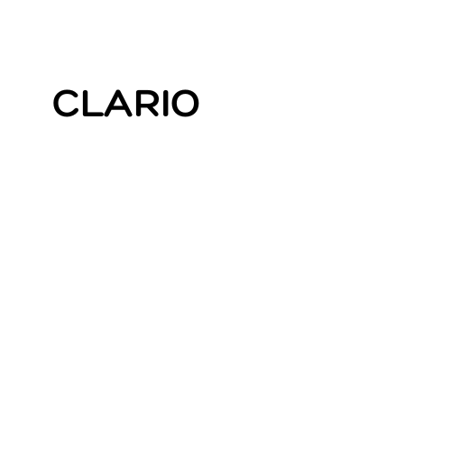

# Clario

## 🌐 Proyecto
Clario es una plataforma de **recolección y análisis de datos** pensada para brindar **información transparente, confiable y accesible**.  
Nuestro propósito es que cualquier persona pueda contrastar lo que dicen los medios o descartar fake news mediante **dashboards claros y objetivos**.  

---

## 🎯 Misión
Mostrar la verdad a través de los datos, con un compromiso ético:  
> **Nunca se manipularán ni falsearán los resultados, sin importar quién financie los informes.**

---

## 👁️ Visión
Que los datos y la verdad sean accesibles para todas las personas, en cualquier lugar.  

---

## ⚙️ Tecnologías utilizadas
- **Frontend**: HTML, CSS, JavaScript  
- **Backend**: Flask (Python)  
- **Base de datos**: SQL / Excel  
- **Visualización**: Power BI  
- **Automatización inicial**: WhatsApp como canal de recolección  

---

## 🚀 Avances actuales
- Diseño inicial de la web  
- Estructura básica de Flask para backend  
- Integración planificada con Power BI para dashboards  
- Definición de flujo de carga de datos vía WhatsApp  

---

## 📌 Roadmap
- [ ] Publicar demo inicial en GitHub Pages  
- [ ] Conectar módulo de carga de datos con base SQL  
- [ ] Integrar primer dashboard interactivo en Power BI  
- [ ] Beta cerrada para primeros testers  

---

## 👨‍💻 Equipo
- **Mauro Díaz** – Fundador y analista de datos  
- **Colaboración IA (ChatGPT)** – Soporte técnico y documentación  

---

## 📫 Contacto
Pronto habilitaremos una página de contacto para interesados en informes y dashboards.  
Mientras tanto, podés conectar con nosotros en **LinkedIn**.  

